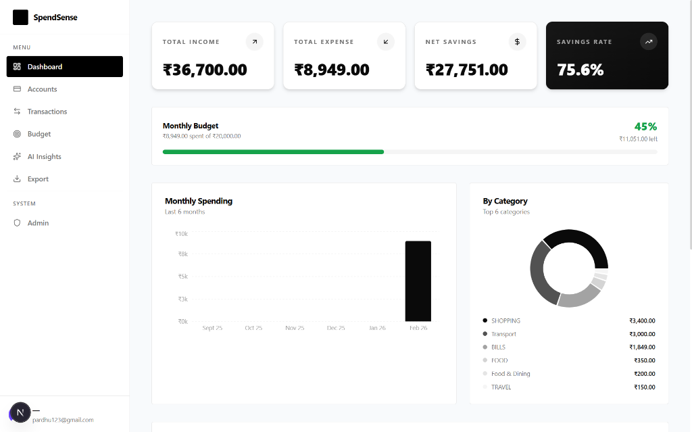
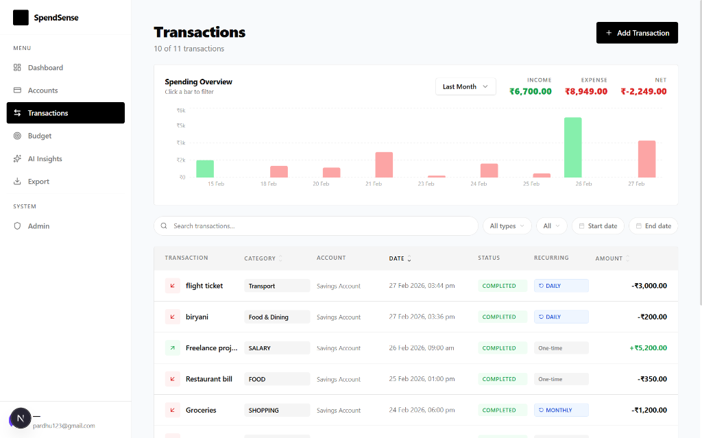
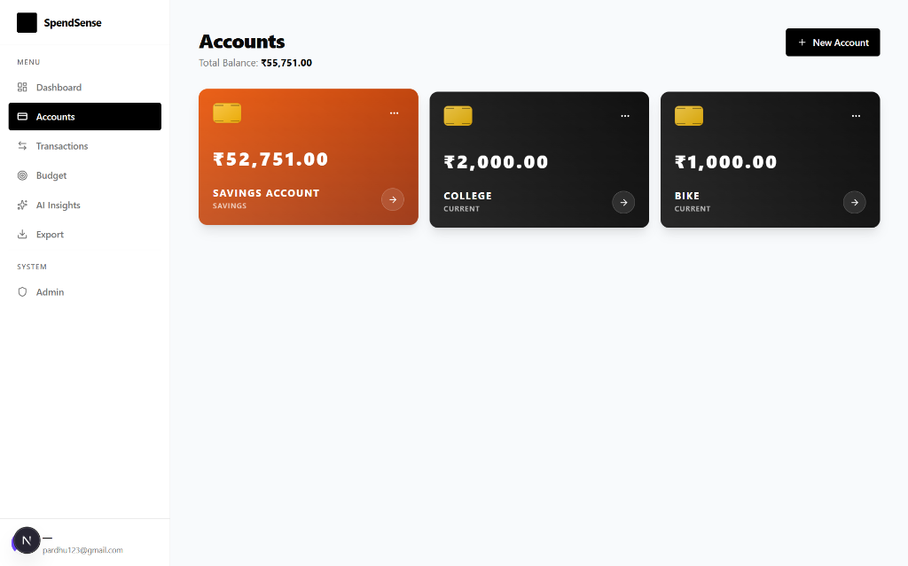
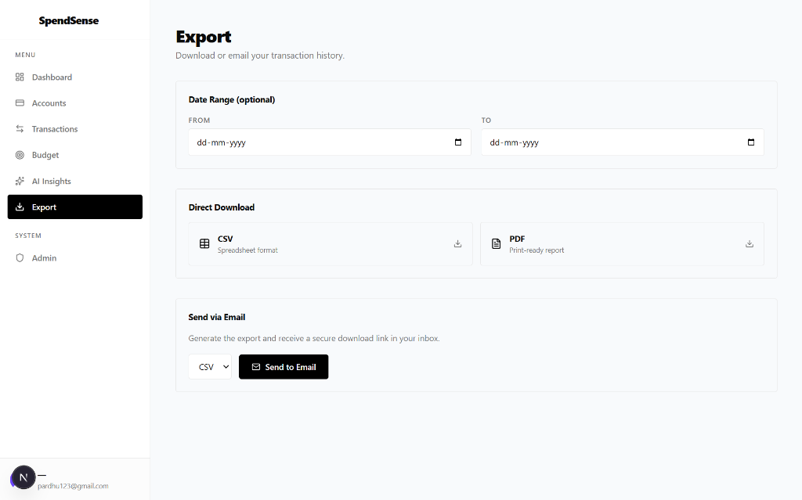

# SpendSense - AI-Powered Personal Finance Intelligence

> Try the app first: https://spendsense-finance.vercel.app/

> Most people track expenses after they overspend.
> SpendSense helps you stay ahead - with real-time insights, anomaly detection, and proactive budget alerts.

SpendSense is a full-stack personal finance platform built with Spring Boot and Next.js. It combines reliable finance tracking with practical AI: scan receipts, get spending insights, detect anomalies, and receive budget alerts before you overspend.

---

## What Is This?

SpendSense is not just a tracker - it is a decision-making system.

Most finance tools show transactions after the fact. SpendSense helps users understand behavior while it is happening, so they can act earlier and avoid unnecessary overspending.

Instead of only listing transactions, it helps users:

- Understand spending patterns clearly across accounts and categories
- Detect unusual behavior early with AI-assisted anomaly analysis
- Take action before budgets are exceeded using proactive alerts and recommendations

It also gives you:

1. Multi-account money tracking - CURRENT and SAVINGS accounts with balances.
2. Full transaction operations - create, edit, delete, paginate, and filter income/expense entries.
3. Recurring automation - daily/weekly/monthly/yearly recurring transactions processed by scheduler jobs.
4. AI receipts and insights - Gemini Vision for receipt extraction and Gemini text analysis for spending intelligence.
5. Export and email workflows - CSV/PDF download and async email delivery with temporary links.
6. Production-grade backend controls - Clerk JWT auth, role-based access, Redis caching, Flyway migrations, and IP rate limiting.

---

## Why I Built This

Most finance tools show data but do not help users act on it.
I built SpendSense to bridge that gap - combining tracking with intelligent insights and automation.

---

## Who Is It For?

| User Type | What They Get |
|---|---|
| Personal Users | Account tracking, budgets, analytics, AI insights, receipt scanner, exports |
| Power Users | Monthly insight emails, anomaly detection, recurring finance automation |
| Admins | User management, role updates, moderation controls |

---

## Architecture

SpendSense is a two-tier application with managed external services.

```text
+------------------------------------------------------------------+
|                            Browser                               |
|                 Next.js 16 + Clerk Frontend SDK                 |
+-------------------------------+----------------------------------+
                                | HTTPS + Bearer JWT
                                v
+------------------------------------------------------------------+
|                     Spring Boot API (Java 21)                    |
| REST Controllers | Security Filters | Services | Schedulers      |
| RateLimitFilter -> Spring Security JWT -> Controller -> Service  |
+-------------+--------------------+----------------+--------------+
              |                    |                |
              v                    v                v
       PostgreSQL 15+          Redis 7+        External APIs
       (Flyway schema)      (cache + quotas)   Clerk, Gemini,
                                                Appwrite, Resend
```

---

## Key Design Decisions

| Decision | Why |
|---|---|
| Clerk as identity provider | Offloads auth complexity (sessions, MFA, OAuth, JWT lifecycle) and keeps backend focused on domain logic |
| JWT resource server in Spring Security | Server-side verification against Clerk issuer/JWKS, no custom token parsing |
| RateLimitFilter before security chain | Rejects abusive traffic early and reduces expensive downstream work |
| Redis + DB layered AI caching | AI insights are expensive; cache first, persist second, regenerate only when needed |
| Flyway-only schema evolution | Predictable and versioned database changes across environments |
| Appwrite for receipts and exports | Durable object storage without coupling to local disk in production |
| Resend HTTP email API | Reliable outbound email from hosted environments where SMTP may be restricted |
| Scheduled automation | Recurring txns, budget alerts, monthly insights, and export cleanup run without manual operations |

---

## Features

### Core Finance
- Multi-account management (CURRENT and SAVINGS)
- Transaction CRUD with categories, descriptions, statuses, and timestamps
- Recurring transactions with catch-up logic after downtime
- Monthly budget creation, update, delete, and usage tracking

### AI and Intelligence
- Receipt scanning from image uploads using Gemini Vision
- Spending insight generation (summary, patterns, recommendations)
- Anomaly detection and budget recommendations endpoints
- Monthly personalized AI insight emails

### How AI Works
- Extracts structured data from receipts using vision models
- Analyzes transaction history to detect patterns and anomalies
- Generates actionable insights and recommendations
- Runs periodic analysis for monthly reports and alerts

### Analytics and Reporting
- Dashboard analytics summary
- Trend and category analysis endpoints
- Month-over-month comparison endpoint
- CSV and PDF exports
- Async export-to-email with secure temporary download links

### Security and Platform
- Clerk JWT authentication and webhook-based profile sync
- Role-based authorization (`USER`, `ADMIN`)
- IP-based rate limiting with configurable RPM
- Security headers and environment-specific CORS
- Redis-backed cache strategy for analytics and AI insights

---

## 📸 Preview

### Dashboard


### Transactions and Receipt Scanning Flow


### Accounts


### Export


---

## Tech Stack

| Layer | Technology |
|---|---|
| Frontend | Next.js 16, React 19, TypeScript 5 |
| Frontend UI | Tailwind CSS, Radix UI, Recharts, Framer Motion |
| Frontend Data | TanStack Query, React Hook Form, Zod |
| Auth | Clerk (`@clerk/nextjs`) |
| Backend | Spring Boot 3.4.2, Java 21 |
| Security | Spring Security OAuth2 Resource Server (JWT) |
| Data | PostgreSQL 15+, Spring Data JPA, Flyway |
| Cache | Redis + Spring Cache + Caffeine |
| AI | Google Gemini 2.5 Flash (text + vision) |
| Storage | Appwrite buckets (receipts + exports) |
| Email | Resend HTTP API |
| Docs | SpringDoc OpenAPI (Swagger in dev profile) |

---

## Project Structure

```text
spendsense-migration/
+- backend/                          # Spring Boot API
|  +- pom.xml
|  +- Dockerfile
|  +- src/main/java/com/spendsense/
|     +- config/                     # Security, cache, openapi, integrations
|     +- controller/                 # REST API controllers
|     +- dto/                        # Request/response models
|     +- exception/                  # Global error handling
|     +- mapper/                     # Entity <-> DTO mappers
|     +- model/                      # Entities and enums
|     +- repository/                 # Spring Data repositories
|     +- scheduler/                  # Cron jobs
|     +- security/                   # JWT + rate limiting + webhook verification
|     +- service/                    # Domain and integration services
|  +- src/main/resources/
|     +- application.yml
|     +- db/migration/               # Flyway SQL migrations (V1..V9)
|
+- frontend/                         # Next.js App Router app
|  +- app/
|  |  +- page.tsx                    # Public landing page
|  |  +- sign-in/                    # Clerk sign-in route
|  |  +- sign-up/                    # Clerk sign-up route
|  |  +- (app)/                      # Protected app shell routes
|  |     +- dashboard/
|  |     +- accounts/
|  |     +- transactions/
|  |     +- budget/
|  |     +- insights/
|  |     +- export/
|  |     +- admin/
|  +- components/
|  +- lib/
|  +- types/
|  +- proxy.ts                       # Route protection middleware
|
+- docs/                             # Deep architecture and implementation docs
```

---

## Prerequisites

| Requirement | Version |
|---|---|
| Node.js | 20+ |
| Java | 21 |
| Maven | 3.9+ |
| PostgreSQL | 15+ |
| Redis | 7+ |

### Required External Accounts
- Clerk project (auth + webhooks)
- Google Gemini API key
- Appwrite project and storage buckets
- Resend API key

---

## Getting Started

### 1) Clone

```bash
git clone <your-repo-url>
cd spendsense-migration
```

### 2) Set up PostgreSQL and Redis

```sql
CREATE DATABASE spendsense_dev;
```

Start Redis locally (example):

```bash
docker run -d --name spendsense-redis -p 6379:6379 redis:7-alpine
```

### 3) Backend setup

```bash
cd backend
# Windows
copy .env.example .env
# macOS/Linux
# cp .env.example .env

mvnw.cmd spring-boot:run
# macOS/Linux: ./mvnw spring-boot:run
```

Backend base URL: `http://localhost:8080/api/v1`

### 4) Frontend setup

Create `frontend/.env.local` manually with the required frontend variables.

```bash
cd frontend
npm install
npm run dev
```

Frontend URL: `http://localhost:3000`

---

## Environment Variables

### Frontend (`frontend/.env.local`)

| Variable | Required | Example |
|---|---|---|
| `NEXT_PUBLIC_API_URL` | Yes | `http://localhost:8080/api/v1` |
| `NEXT_PUBLIC_CLERK_PUBLISHABLE_KEY` | Yes | `pk_test_...` |
| `CLERK_SECRET_KEY` | Yes | `sk_test_...` |
| `NEXT_PUBLIC_CLERK_SIGN_IN_URL` | No | `/sign-in` |
| `NEXT_PUBLIC_CLERK_SIGN_UP_URL` | No | `/sign-up` |
| `NEXT_PUBLIC_CLERK_AFTER_SIGN_IN_URL` | No | `/dashboard` |
| `NEXT_PUBLIC_CLERK_AFTER_SIGN_UP_URL` | No | `/dashboard` |

### Backend (`backend/.env`)

| Variable | Required | Example |
|---|---|---|
| `SPRING_PROFILES_ACTIVE` | Yes | `dev` |
| `DATABASE_URL` | Yes | `jdbc:postgresql://localhost:5432/spendsense_dev` |
| `DATABASE_USERNAME` | Yes | `postgres` |
| `DATABASE_PASSWORD` | Yes | `your_password` |
| `CLERK_ISSUER_URI` | Yes | `https://<your-clerk-domain>` |
| `CLERK_WEBHOOK_SECRET` | Yes | `whsec_...` |
| `GEMINI_API_KEY` | Yes | `AIza...` |
| `APPWRITE_PROJECT_ID` | Yes | `your_project_id` |
| `APPWRITE_API_KEY` | Yes | `your_appwrite_api_key` |
| `APPWRITE_RECEIPTS_BUCKET_ID` | Yes | `receipts` |
| `APPWRITE_EXPORTS_BUCKET_ID` | Yes | `exports` |
| `RESEND_API_KEY` | Yes | `re_...` |
| `REDIS_HOST` | No | `localhost` |
| `REDIS_PORT` | No | `6379` |
| `REDIS_PASSWORD` | No | `` |
| `REDIS_SSL_ENABLED` | No | `false` |
| `RATE_LIMIT_ENABLED` | No | `true` |
| `RATE_LIMIT_RPM` | No | `100` |
| `TRUST_X_FORWARDED_FOR` | No | `false` |
| `APP_FRONTEND_URL` | No | `http://localhost:3000` |
| `APP_BACKEND_URL` | No | `http://localhost:8080` |

---

## API Reference

**Backend base URL:** `http://localhost:8080/api/v1`  
**Auth:** `Authorization: Bearer <JWT>` on all protected endpoints

### Public Endpoints

| Method | Endpoint | Auth | Description |
|---|---|---|---|
| `GET` | `/health` | Public | Basic app health check |
| `GET` | `/actuator/health` | Public | Spring Actuator health status |
| `POST` | `/webhooks/clerk` | Public (signed webhook) | Clerk user sync webhook (`user.created`, `user.updated`, `user.deleted`) |
| `GET` | `/export/download/{filename}` | Public | Download export file from email link |

### Users

| Method | Endpoint | Auth | Description |
|---|---|---|---|
| `GET` | `/users/me` | Protected | Get current authenticated user profile |

### Accounts

| Method | Endpoint | Auth | Description |
|---|---|---|---|
| `POST` | `/accounts` | Protected | Create account |
| `GET` | `/accounts` | Protected | List all user accounts |
| `GET` | `/accounts/{id}` | Protected | Get account by ID |
| `PUT` | `/accounts/{id}` | Protected | Update account |
| `DELETE` | `/accounts/{id}` | Protected | Delete account |

### Transactions

| Method | Endpoint | Auth | Description |
|---|---|---|---|
| `POST` | `/transactions` | Protected | Create transaction |
| `GET` | `/transactions` | Protected | List transactions (paginated) |
| `GET` | `/transactions/account/{accountId}` | Protected | List transactions for one account |
| `GET` | `/transactions/{id}` | Protected | Get transaction by ID |
| `PUT` | `/transactions/{id}` | Protected | Update transaction |
| `DELETE` | `/transactions/{id}` | Protected | Delete transaction |

### Budget

| Method | Endpoint | Auth | Description |
|---|---|---|---|
| `POST` | `/budget` | Protected | Create budget |
| `GET` | `/budget` | Protected | Get current user budget |
| `PUT` | `/budget` | Protected | Update budget |
| `DELETE` | `/budget` | Protected | Delete budget |

### Analytics

| Method | Endpoint | Auth | Description |
|---|---|---|---|
| `GET` | `/analytics` | Protected | Get analytics summary (supports `months`, `refresh`) |
| `GET` | `/analytics/trends` | Protected | Monthly trends |
| `GET` | `/analytics/categories` | Protected | Category-wise spending analysis |
| `GET` | `/analytics/comparison` | Protected | Current vs previous month comparison |

### AI Insights

| Method | Endpoint | Auth | Description |
|---|---|---|---|
| `GET` | `/ai/insights` | Protected | Get AI insights (cached or fresh) |
| `POST` | `/ai/insights/refresh` | Protected | Force refresh AI insights |
| `GET` | `/ai/insights/anomalies` | Protected | Detect unusual spending patterns |
| `GET` | `/ai/insights/recommendations` | Protected | Get AI budget recommendations |

### Receipts

| Method | Endpoint | Auth | Description |
|---|---|---|---|
| `POST` | `/receipts/scan` | Protected | Upload receipt image and extract transaction data |
| `GET` | `/receipts/{filename}` | Protected | Download stored receipt image |
| `DELETE` | `/receipts/{filename}` | Protected | Delete stored receipt image |

### Export

| Method | Endpoint | Auth | Description |
|---|---|---|---|
| `GET` | `/export/csv` | Protected | Export transactions as CSV |
| `GET` | `/export/pdf` | Protected | Export transactions as PDF |
| `POST` | `/export/email` | Protected | Generate export and send download link via email |
| `GET` | `/export/download/{filename}` | Public | Download generated export by filename |

### Admin

| Method | Endpoint | Auth | Description |
|---|---|---|---|
| `GET` | `/admin/users` | Admin only | List all users |
| `PATCH` | `/admin/users/{id}/role?role=USER|ADMIN` | Admin only | Update user role |
| `DELETE` | `/admin/users/{id}` | Admin only | Delete user |

---

## Rate Limiting and Scheduling

### Rate Limiting
- Implemented in `RateLimitFilter` using Bucket4j.
- Default is `100 requests per minute` per client IP.
- Skips health and webhook endpoints.

### Scheduler Jobs
- Recurring transaction processing: every 6 hours + startup catch-up.
- Budget alerts: daily at 8 AM (Asia/Kolkata).
- Monthly AI insights email: 1st day of month at 8 AM (Asia/Kolkata).
- Export cleanup: weekly Sunday 3 AM (Asia/Kolkata).

---

## Testing

### Backend

```bash
cd backend
mvnw.cmd test
# macOS/Linux: ./mvnw test
```

### Frontend

```bash
cd frontend
npm run lint
npm run build
```

---

## Deployment Notes

| Service | Suggested Platform |
|---|---|
| Frontend | Vercel |
| Backend | Render / Railway / DigitalOcean |
| PostgreSQL | Managed PostgreSQL |
| Redis | Upstash / Redis Cloud |
| Appwrite | Appwrite Cloud / self-hosted |
| Email | Resend |

Production tips:
- Set `SPRING_PROFILES_ACTIVE=prod` in backend.
- Set `APP_FRONTEND_URL` to your deployed frontend URL for strict CORS.
- Set `TRUST_X_FORWARDED_FOR=true` only when behind a trusted reverse proxy.
- Keep Swagger disabled in production profile.

---

## Author

**Seerapu Pardha Saradhi**

- GitHub: [Pardhasaradhi-SDE](https://github.com/Pardhasaradhi-SDE)
- LinkedIn: [seerapu-pardha-saradhi](https://linkedin.com/in/seerapu-pardha-saradhi)

If this project helps you, consider starring the repository.
